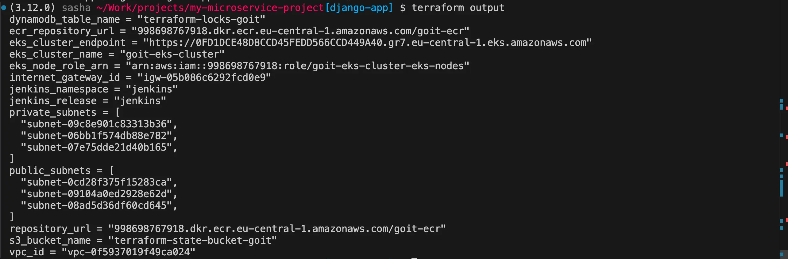
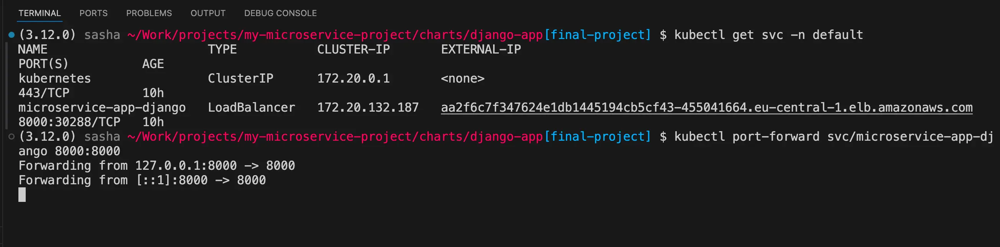
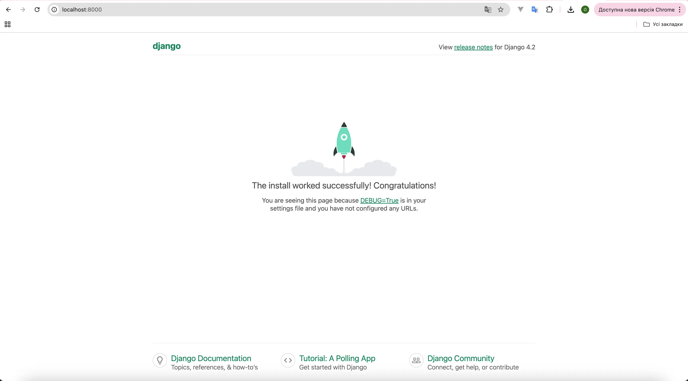
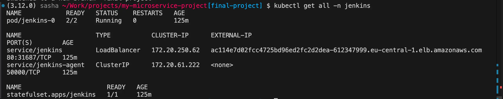
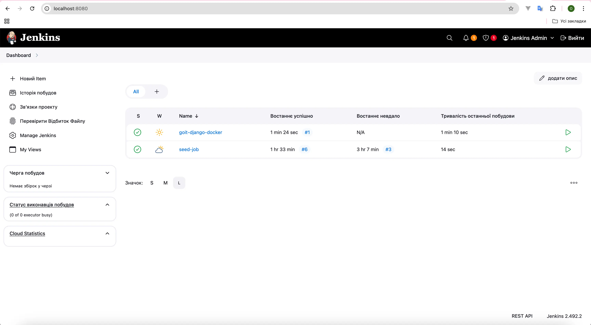
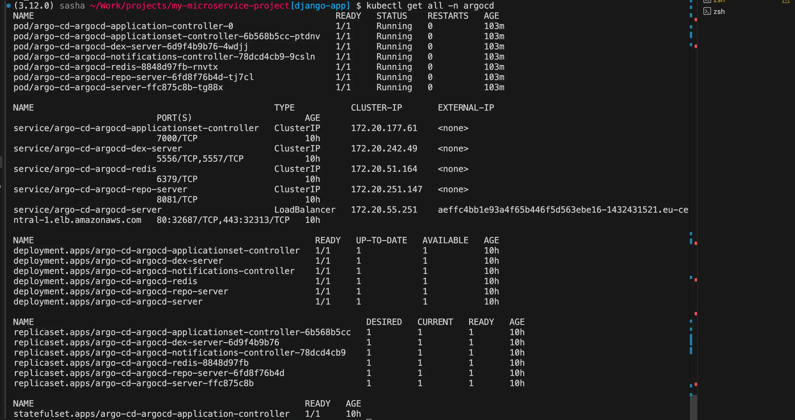
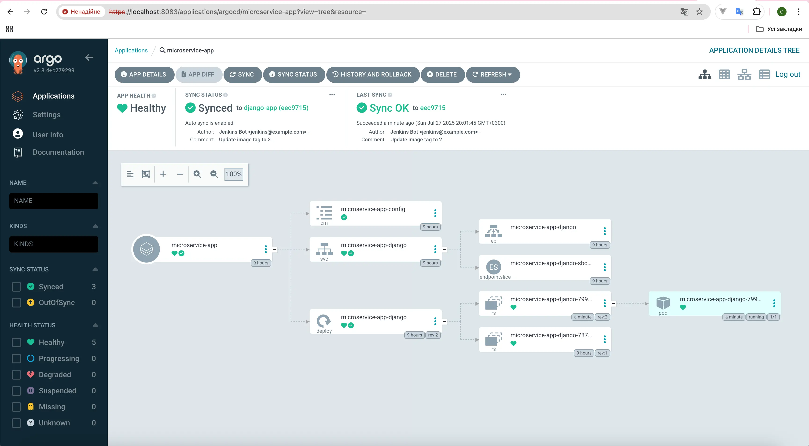
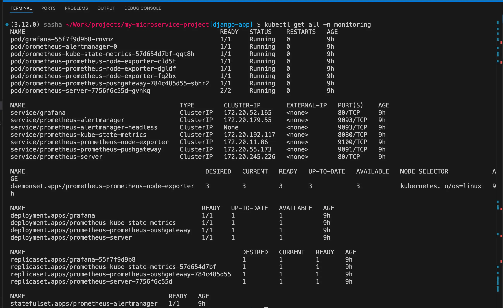
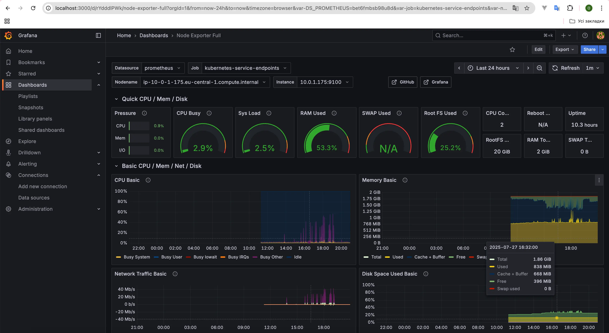

# Django Application Deployment

Deploy Django app with **Terraform**, **AWS EKS**, **ECR**, **Helm**, and **Argo CD**.

---

## 1. Clone the repository

```sh
git clone https://github.com/zharuk-alex/microservice-project.git
cd microservice-project
git checkout lesson-10
```

---

## 2. Deploy infrastructure (Terraform)

```sh
terraform init
terraform apply
```

Optional: Use S3 as backend  
Uncomment block in `backend.tf`, then:

```sh
terraform init -reconfigure
terraform plan
terraform apply
```

Check resources:

```sh
terraform state list
```

---

## 3. Connect to EKS cluster

```sh
aws eks --region eu-central-1 update-kubeconfig --name goit-eks-cluster
kubectl get nodes
```

---

## 4. Build & push Docker image to ECR (optional, if not using Jenkins)

```sh
docker buildx build --platform linux/amd64 --no-cache -t django-app:latest .

docker tag django-app:latest <aws_account_id>.dkr.ecr.eu-central-1.amazonaws.com/goit-ecr:latest

aws ecr get-login-password --region eu-central-1 \
| docker login --username AWS --password-stdin <aws_account_id>.dkr.ecr.eu-central-1.amazonaws.com

docker push <aws_account_id>.dkr.ecr.eu-central-1.amazonaws.com/goit-ecr:latest
```

---

## 5. Deploy Django app via Helm

```sh
cd charts/django-app
helm upgrade --install my-django-release .
```

---

## 6. Access the application (optional if using Argo CD with auto-sync)

```sh
kubectl get svc my-django-release-django
```

- Open: `http://<EXTERNAL-IP>:8000`  
  or `http://<EXTERNAL-HOSTNAME>:8000`

---

## 7.Verify Jenkins

Check Jenkins pod status:

```sh
kubectl get pods -n jenkins
```

Get Jenkins service endpoint:

```sh
kubectl get svc -n jenkins
```

Get Jenkins admin password:

```sh
kubectl get secret jenkins -n jenkins -o jsonpath="{.data.jenkins-admin-password}" | base64 -d && echo
```

Login in browser:

```
http://<EXTERNAL-IP>
```

OR

```
kubectl port-forward -n jenkins svc/jenkins 8080:80
```

and open http://localhost:8080
Username: `admin`  
Password: _(from command above)_

---

## 8. Access Argo CD

```sh
kubectl get pods -n argocd
kubectl get svc -n argocd
```

Get Argo admin password:

```sh
kubectl -n argocd get secret argocd-initial-admin-secret \
-o jsonpath="{.data.password}" | base64 -d && echo
```

- Login: `admin`
- URL: `http://<ARGOCD-EXTERNAL-IP>`

OR

```
kubectl port-forward svc/argo-cd-argocd-server -n argocd 8083:80
```

and open http://localhost:8083
Username: `admin`

---

## 9. Verify RDS database (Aurora / PostgreSQL / etc.)

Check if the RDS instance is created and available:

```sh
aws rds describe-db-instances \
  --region eu-central-1 \
  --query "DBInstances[*].{ID:DBInstanceIdentifier,Status:DBInstanceStatus,Endpoint:Endpoint.Address}" \
  --output table
```

---

## 10. Prometheus

```
helm repo add prometheus-community https://prometheus-community.github.io/helm-charts
helm repo update
kubectl create namespace monitoring
helm install prometheus prometheus-community/prometheus \
  --namespace monitoring
```

check if Prometheus installed:

```
kubectl get pods -n monitoring
```

Prometeus Gui:

```
kubectl port-forward -n monitoring svc/prometheus-server 9090:80
```

---

## 11. Grafana:

```
helm repo add grafana https://grafana.github.io/helm-charts
helm repo update

helm install grafana grafana/grafana \
  --namespace monitoring \
  --create-namespace \
  --set adminPassword=admin123
```

Grafana Gui:

```
kubectl port-forward svc/grafana 3000:80 -n monitoring
```

---

## Destroy infrastructure

```sh
terraform destroy
```

## Screenshots:

<details>
  <summary>terraform</summary>

```sh
terraform output
```

  
</details>

<details>
  <summary>django</summary>

```sh
kubectl get svc -n default
kubectl port-forward svc/microservice-app-django 8000:8000
```

  
  
</details>

<details>
  <summary>jenkins</summary>

```sh
kubectl get all -n jenkins
```

  
  
</details>

<details>
  <summary>argocd</summary>

```sh
kubectl get all -n argocd
```

  
  
</details>

<details>
  <summary>monitoring</summary>

```sh
kubectl get all -n monitoring
```

  
  
  
</details>
